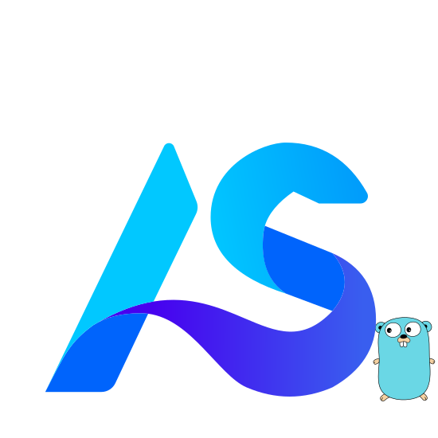

<p align="center">
  
</p>

<h1 align="center">AgentScope Go</h1>

<p align="center">
  面向 Go 生态的多智能体应用开发框架。
</p>

<p align="center">
  <a href="README.md">English</a> | <a href="README-zh.md">简体中文</a>
</p>

<p align="center">
  <a href="https://github.com/yuluo-yx/agentscope-go/actions/workflows/ci.yml"></a>
  <a href="go.mod"></a>
  <a href="LICENSE"></a>
  <a href=".pre-commit-config.yaml"></a>
</p>

## AgentScope Go 是什么？

AgentScope Go 覆盖智能体、消息、模型适配、工具、状态、工作区资源与事件化执行流程。它面向希望在 Go
服务中构建 AI Agent 的开发者，强调运行时显式、可测试、易集成。

## 环境要求

- Go `1.26.3` 或更高版本。
- 使用仓库内 Makefile 目标时需要 GNU Make。
- 如需完整运行本地 lint 和文档工具，建议安装 Python `3.13+`、Node.js
  `22+` 和 npm `10+`。

## 快速开始

在 Go 项目中安装模块：

```bash
go get github.com/yuluo-yx/agentscope-go@latest
```

公共 API 统一组织在 `pkg/` 导入根下。例如，使用
`github.com/yuluo-yx/agentscope-go/pkg/agent` 导入 Agent 能力，
使用 `github.com/yuluo-yx/agentscope-go/pkg/message` 导入消息类型，
使用 `github.com/yuluo-yx/agentscope-go/pkg/model/dashscope` 导入 DashScope
模型适配器。

运行一个不需要模型 API Key 的本地示例：

```bash
go run ./example/message
```

运行 DashScope 在线模型示例：

```bash
export AI_DASHSCOPE_API_KEY="<your DashScope API key>"
go run ./example/model/dashscope
```

最小 ChatModel 调用示例：

```go
package main

import (
    "context"
    "fmt"
    "os"

    "github.com/yuluo-yx/agentscope-go/pkg/message"
    asmodel "github.com/yuluo-yx/agentscope-go/pkg/model"
    "github.com/yuluo-yx/agentscope-go/pkg/model/dashscope"
)

func main() {
    chat, err := dashscope.NewChatModel(
        dashscope.NewCredential(os.Getenv("AI_DASHSCOPE_API_KEY")),
        "qwen-plus",
    )
    if err != nil {
        panic(err)
    }

    user, err := message.NewUserMessage("user", "Say hello in one short sentence.")
    if err != nil {
        panic(err)
    }

    response, err := chat.Call(context.Background(), asmodel.CallRequest{
        Messages: []*message.Message{user},
    })
    if err != nil {
        panic(err)
    }

    fmt.Println(response.Content)
}
```

## 示例

每个示例都是独立 Go module，包含自己的 `go.mod`、英文 `README.md` 和中文 `README-zh.md`。

| 示例 | 说明 |
| --- | --- |
| [`example/agent/basic`](example/agent/basic) | 构建由 ChatModel 驱动的基础智能体。 |
| [`example/agent/configuration`](example/agent/configuration) | 配置 model fallback、ReAct 限制和上下文清理。 |
| [`example/agent/context_strategy`](example/agent/context_strategy) | 配置摘要压缩、workspace offload 和自定义上下文策略。 |
| [`example/agent/external`](example/agent/external) | 围绕外部执行工具暂停并恢复 Agent。 |
| [`example/agent/hooks`](example/agent/hooks) | 实现围绕 reply、reasoning、model call、acting 和 system prompt 的 Agent middleware hook。 |
| [`example/agent/middleware_tracing`](example/agent/middleware_tracing) | 追踪 reply、model call 和 tool execution middleware span。 |
| [`example/agent/permission`](example/agent/permission) | 处理权限确认，并恢复等待中的工具调用。 |
| [`example/message`](example/message) | 组织 user、assistant、system 和 tool 消息。 |
| [`example/model/dashscope`](example/model/dashscope) | 调用 DashScope 模型并演示模型工具调用。 |
| [`example/model/providers`](example/model/providers) | 对比当前可用的模型 Provider 适配。 |
| [`example/integration/gin`](example/integration/gin) | 通过 Gin 暴露底层 ChatModel 流式和 Agent 事件流式。 |
| [`example/integration/kratos`](example/integration/kratos) | 通过 Kratos 暴露底层 ChatModel 流式和 Agent 事件流式。 |
| [`example/tool/function`](example/tool/function) | 注册 function tool，并由模型 tool call 驱动执行。 |
| [`example/tool/builtin`](example/tool/builtin) | 结合权限使用 builtin shell 和 filesystem tool。 |
| [`example/tool/mcp`](example/tool/mcp) | 连接 MCP server，并将 MCP tool 暴露给智能体。 |
| [`example/tool/skill`](example/tool/skill) | 将本地 `SKILL.md` 资源加载为智能体工具。 |
| [`example/tool/task`](example/tool/task) | 将任务式工作包装为工具。 |
| [`example/workspace/local`](example/workspace/local) | 为 AI 工具工作流提供本地 workspace 文件上下文。 |
| [`example/workspace/docker`](example/workspace/docker) | 在 Docker 容器中运行 workspace 工具，并把结果交给 ChatModel。 |
| [`example/workspace/microsandbox`](example/workspace/microsandbox) | 在本地 Microsandbox microVM 中运行 workspace 工具，并可选交给 DashScope 总结。 |
| [`example/workspace/agentsandbox`](example/workspace/agentsandbox) | 在 Kubernetes Agent Sandbox 运行时中执行 workspace 工具。 |

想快速理解框架用法时，建议先从这些示例开始。

> Tips: 如果出现依赖问题，请先 `go mod tidy` 下再 `go run .`。

## 文档

- 英文文档：[`docs/en/intro.md`](docs/en/intro.md)
- 中文文档：[`docs/zh/intro.md`](docs/zh/intro.md)
- 示例索引：[`example/README.md`](example/README.md)

## 本地开发

初始化本地工具链：

```bash
make setup
make install-tools
```

常用命令：

| 命令 | 作用 |
| --- | --- |
| `make fmt` | 格式化 Go 代码。 |
| `make lint-go` | 运行 `golangci-lint`。 |
| `make test` | 使用 race detector 运行完整 Go 测试。 |
| `make coverage` | 生成完整覆盖率结果。 |
| `make docs-check` | 构建并检查文档。 |
| `make security-check` | 执行本地密钥扫描。 |
| `.venv/bin/pre-commit run --all-files` | 运行提交前本地检查。 |

当前 README 不记录 release 自动化流程；发布时以维护者给出的发布说明为准。

## 安全

提交漏洞前请先阅读 [`SECURITY_zh.md`](SECURITY_zh.md)。AgentScope Go 是一个库
框架，不是托管服务；应用开发者负责控制运行时可用的工具、模型 Provider、
workspace、MCP server 和凭据。

## 贡献

欢迎参与贡献。提交 PR 前请阅读 [`CONTRIBUTING.md`](CONTRIBUTING.md) 或
[`CONTRIBUTING_zh.md`](CONTRIBUTING_zh.md)，并遵守
[`CODE_OF_CONDUCT_zh.md`](CODE_OF_CONDUCT_zh.md)。

## 贡献者

<p align="center">
  <a href="https://github.com/yuluo-yx/agentscope-go/graphs/contributors">
    
  </a>
</p>

## 许可证

AgentScope Go 使用 [Apache License 2.0](LICENSE) 许可证。
